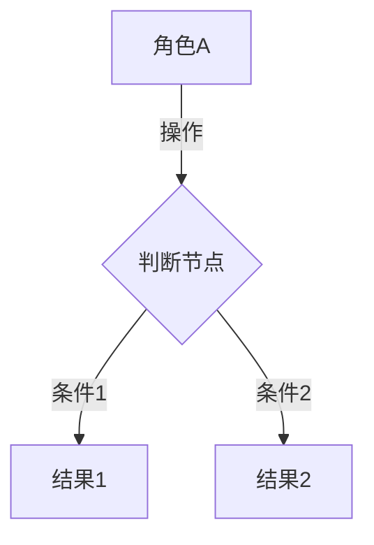
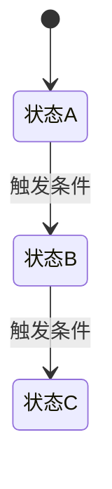

# [产品/模块名称] PRD

**版本**：v1.0 | **作者**： | **日期**：YYYY-MM-DD | **状态**：草稿 / 评审中 / 已确认
**上游锚点**：Feature List v__ + Page Structure v__
**关联需求**：

---

## 1. 文档概述

### 1.1 一句话描述

> [用一句话说清楚本次交付的核心能力]

### 1.2 核心业务流程



### 1.3 与现有系统的关系

- **新增模块**：
- **修改模块**：
- **外部系统交互**：
- **对已有功能的影响**：

---

## 2. 范围

### 2.1 本期功能范围

- FL-01 [功能点名称]（高）
- FL-02 [功能点名称]（高）
- FL-03 [功能点名称]（中）
- ...

### 2.2 非目标

> 本期不覆盖：
> -

### 2.3 待确认项

- [待确认内容]——影响 [影响范围]，需要 [谁] 确认，当前假设：[假设]

---

## 3. 用户角色与权限

### 3.1 角色定义

- **[角色1]**：[职责]，主要使用 [场景]
- **[角色2]**：[职责]，主要使用 [场景]

### 3.2 权限矩阵

| 操作 | [角色1] | [角色2] | [角色3] |
|------|---------|---------|---------|
| [操作1] | | | |
| [操作2] | | | |

> 权限类型：✅ 可见 / 🔧 可操作 / ✅ 可审批 / ⚙️ 可配置 / ❌ 无权限

---

## 4. 数据字典

### 4.1 核心实体关系


### 4.2 字段定义

#### [实体名称]

**[字段名称]**
- 类型：[文本/数字/日期/枚举/文件]
- 来源：[用户填写 / 系统生成 / 外部同步 / 关联查询]
- 必填：[是/否]
- 默认值：[值]
- 校验规则：[规则]
- 枚举值：[值1、值2、值3]（仅枚举类型）
- 展示格式：[格式说明]
- 脱敏规则：[规则]（如涉及敏感信息）

**[字段名称]**
- 类型：...
- ...

### 4.3 数据来源与流向

- [数据A]：由 [来源] 产生，流向 [目标]，[实时/定时/手动] 更新
- [数据B]：...

---

## 5. 详细需求说明

> 本章按页面组织，每个页面对应原型中的一个界面。
> 页面顺序与 Page Structure 中的定义一致。
>
> **写作规范**：
> - 按复杂度灵活组织，但必须覆盖真实存在的关键场景
> - 以下 9 类场景只要真实存在就必须写，不存在的不要硬凑：
>   1. **展示**：数据怎么展示、展示格式、排序规则、空状态
>   2. **操作**：按钮/链接的触发条件和执行结果
>   3. **输入**：输入方式、校验规则、默认值、格式限制
>   4. **加载**：首次加载、分页加载、搜索加载、加载中状态、空数据状态、加载失败状态
>   5. **弹窗**：弹窗/抽屉/确认框的触发条件、内容、操作项、关闭行为
>   6. **异常**：权限不足、数据异常、网络异常、超时、并发冲突
>   7. **数据规范**：字段展示格式、精度、单位、脱敏、截断规则
>   8. **交互逻辑**：按复杂度分层（见下方详略规则）
>   9. **状态流转与边界场景**：状态变更条件、边界值、临界状态
> - 禁止使用以下模糊表述："需支持"、"需考虑"、"按规范处理"、"详见原型"、"同常规"、"待定"
> - 每条描述必须写清楚具体的触发条件、系统行为和用户可见结果

### 交互逻辑详略规则

交互逻辑不是独立章节，而是功能描述的一部分。按业务复杂度决定详略：

- **简单交互**（如：点击删除、勾选复选框）：1-2 句写清触发、反馈和结果
  - 示例：点击"删除"按钮 → 弹出确认框"确定删除该记录？" → 确认后删除成功，列表移除该行，提示"已删除"
- **中等复杂交互**（如：带校验的表单提交、多步操作）：补充交互顺序、关键状态变化和必要分支
  - 示例：填写表单 → 点击"提交" → 系统校验必填项和格式 → 校验通过：状态变为"待审批"，按钮置灰，通知审批人 → 校验失败：标红错误字段，滚动到第一个错误位置
- **高复杂交互**（如：审批流、多方协作、状态机驱动）：细写触发条件、交互顺序、反馈方式、状态变化、关键分支和中断条件
  - 示例：审批人打开审批详情 → 查看申请信息和历史记录 → 点击"通过" → 系统校验当前状态是否为"待审批" → 通过：状态变为"已通过"，触发建档任务，通知申请人 → 拒绝：弹出必填的拒绝原因输入框 → 提交后状态变为"已拒绝"，通知申请人

---

### 5.1 [页面名称]

> 页面结构引用：PS-__ | 关联功能点：FL-__、FL-__

#### 页面目标

[一句话：用户打开这个页面是为了完成什么事]

#### 页面布局

[从上到下 / 从左到右简述区域组成]

#### 前置条件

- [访问条件]
- [权限要求]

---

##### [区域1名称]

**作用**：[这个区域做什么]

**包含元素**：[按钮] [输入框] [下拉框] [表格] [标签] 等

**展示**：
- [列表/卡片展示什么数据，按什么字段排序，默认排序规则]
- [空状态展示什么]

**操作**：
- [按钮/链接的触发条件和执行结果]

**输入**（如有输入元素）：
- [字段]：输入限制、校验规则、默认值

**加载**：
- 首次进入时加载什么数据，加载中显示什么，加载失败显示什么

**弹窗**（如有弹窗交互）：
- [弹窗名称]：触发条件、弹窗内容、操作项、关闭行为

**交互逻辑**：
[按复杂度分层写，见上方详略规则]

**校验规则**：
- [字段1]：[规则]，提示 [提示语]
- [字段2]：[规则]，提示 [提示语]

**状态与边界**（如有状态相关逻辑）：
- [当前状态] → [触发条件] → [目标状态]，[边界值/临界条件]

---

##### [区域2名称]

**作用**：[这个区域做什么]

**包含元素**：...

（按上述 9 类场景检查，只写真实存在的，不存在的类别省略）

---

#### 页面级异常处理

- [异常场景1]：[处理方式]，用户看到 [提示]
- [异常场景2]：[处理方式]，用户看到 [提示]

#### 验收标准

```text
Given [前置条件]
When [用户操作]
Then [预期结果]
```

---

### 5.2 [页面名称]

> 页面结构引用：PS-__ | 关联功能点：FL-__

#### 页面目标

[一句话]

#### 页面布局

[简述]

#### 前置条件

- [条件]

---

##### [区域名称]

**作用**：[做什么]

**包含元素**：...

（按上述 9 类场景检查，只写真实存在的，不存在的类别省略）

---

#### 页面级异常处理

- ...

#### 验收标准

```text
Given [前置条件]
When [用户操作]
Then [预期结果]
```

---

## 6. 横切规则

> 本章描述不属于单个页面的跨页面逻辑。

### 6.1 状态流转



**[当前状态]** → 触发 [条件] → 变为 **[目标状态]**，执行 [动作]，通知 [对象]

**边界场景**：
- [临界状态1]：[处理方式]
- [并发冲突]：[处理方式]

### 6.2 通知规则

- **[触发事件]**：通过 [通知方式] 通知 [对象]，内容为 "[模板]"，[即时/延迟] 发送
- **[触发事件]**：...

### 6.3 后台任务与定时规则

- **[任务名称]**：[触发条件] 时执行 [动作]，[频率]，失败时 [处理方式]
- ...

### 6.4 跨页面数据流

- **[场景]**：从 [源页面] 传递 [数据] 到 [目标页面]，[触发方式]
- ...

### 6.5 导入导出规则

- **[导入]**：模板格式 [格式]，字段映射 [说明]，校验 [规则]，错误时 [处理]
- **[导出]**：导出范围 [说明]，格式 [格式]，字段 [说明]

---

## 7. 外部接口与依赖

### 7.1 外部系统交互

- **[系统名称]**：[交互内容]，[方向：推送/拉取/双向]，触发条件 [条件]，数据格式 [格式]
- ...

### 7.2 内部模块依赖

- 本期 [模块A] 依赖 [模块B] 的 [依赖内容]，影响：[说明]
- ...

---

## 8. 非功能要求

### 8.1 性能要求

- [场景]：[指标]
- ...

### 8.2 安全要求

- 数据加密：[说明]
- 操作日志：[说明]
- 脱敏规则：[说明]

### 8.3 兼容性要求

- 浏览器：[说明]
- 分辨率：[说明]

---

## 9. 验收标准汇总

- **[页面/功能]**（优先级）：Given ... When ... Then ...
- **[页面/功能]**（优先级）：Given ... When ... Then ...

---

## 10. 实现顺序建议

1. **[页面/功能]**——依赖 [说明]，建议原因：[原因]
2. **[页面/功能]**——依赖 [说明]，建议原因：[原因]
3. ...

---

## 11. 风险与待确认

- **[风险/待确认项]**：影响 [影响]，当前处理：[方式]，负责人：[人]
- ...

---

## 附录

### A. 术语表

- **[术语]**：[定义]
- **[术语]**：[定义]

### B. 变更记录

- **v1.0**（YYYY-MM-DD）：[变更内容]，原因：[原因]
- **v0.9**（YYYY-MM-DD）：[变更内容]，原因：[原因]
